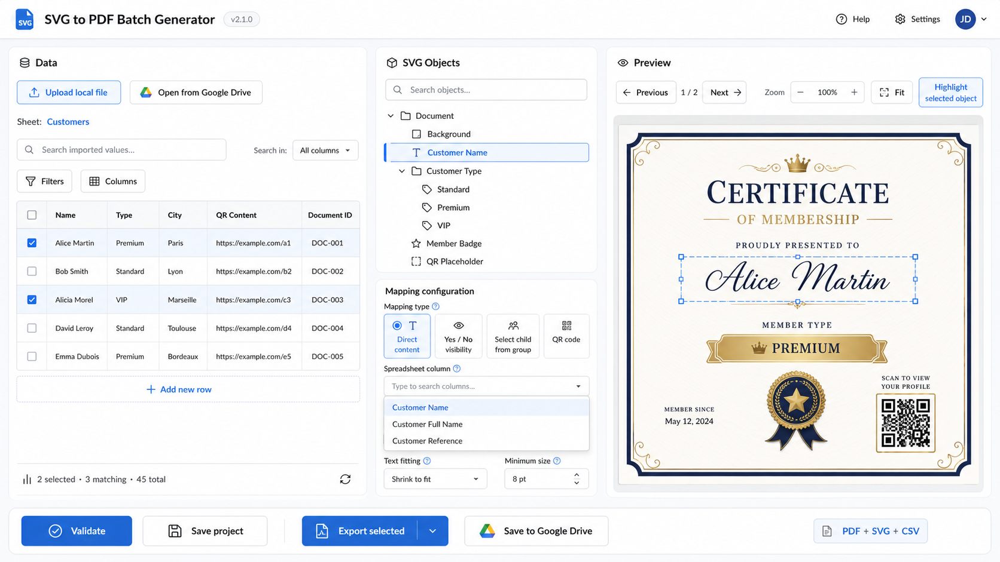

# 03 — UI and components

## Visual reference



Match the reference in structure and density, not pixel-for-pixel.

## Main layout

Desktop:

```text
header
three resizable or fixed-ratio panels
bottom action bar
```

Recommended initial widths:

- data: 38%;
- SVG tree/mapping: 27%;
- preview: 35%.

On desktop, separators between panels support pointer dragging and left/right
arrow keys. Keep practical minimum widths for all three panels.

Below 1100 px:

- stack panels;
- preview first or accessible through tabs;
- hide the resize separators;
- keep the bottom action bar reachable.

## Left panel — Data

Header controls:

- upload local file;
- open from Google Drive when available;
- worksheet selector;
- search imported values;
- search scope selector;
- filters;
- columns.

Grid:

- leading row checkbox;
- sticky header;
- editable cells only after explicit edit action;
- final `+ Add row` line;
- source/modified/manual marker;
- footer counts.

Search:

- searches cell values, not column names;
- supports all columns or chosen columns;
- accent-insensitive and case-insensitive;
- fuzzy matching is optional per search, with a visible exact/fuzzy toggle if results become surprising.

Column filter menu:

- distinct values;
- text contains/equals;
- number range;
- date range;
- blank/non-blank.

Do not reproduce every Excel filter feature.

## Center panel — SVG Objects

Top:

- object search;
- compact source status: Embedded, Linked, Drive, Unavailable, or Modified;
- reload/relink button.

Tree:

- custom component;
- semantic `tree` and `treeitem` roles;
- left/right expands and collapses;
- up/down changes selection;
- enter selects;
- mapped/warning/error status icon;
- search hides nonmatching branches but preserves ancestor context.

Mapping editor:

- target summary;
- mapping type;
- spreadsheet column;
- type-specific options;
- validation message;
- remove mapping.

Use Mantine controls directly.

The selected target owns at most one mapping in the current editor. Mapping
type choices are limited to structurally compatible targets: text and
visibility for text containers; exclusive group, QR, and visibility for
groups; image and visibility for image targets; and visibility for other
addressable elements. Creating a mapping starts with the active worksheet's
first column, while the column selector includes every source column even when
it is hidden from the grid. Switching worksheets does not silently discard a
mapping whose column is absent; validation reports that incompatibility.

Tree mapping badges share the editor's configuration-status derivation.
Unmapped is neutral, Mapped is green, a missing active-worksheet column is a
yellow Warning, and invalid schema, target mismatch, or target/type
incompatibility is a red Error. Each badge includes visible text and a title
with the exact explanation; its symbol is decorative.

## Right panel — Preview

Controls:

- previous/next selected row in active-worksheet order, including selected
  rows hidden by search or filters;
- current selected-row position indicator;
- zoom from 25% to 200% in 25% steps;
- fit to the existing contained 100% presentation;
- highlight selected SVG target.

Preview:

- render the accepted sanitized SVG inside a capability-free sandboxed iframe;
- no direct event handlers from imported SVG;
- highlight the selected target in the derived preview document without
  changing the accepted SVG;
- show a checker or neutral canvas;
- indicate overflow and missing mappings;
- keep QR codes vector.

## Bottom bar

Required actions:

- Validate
- Save project
- Export selected
- Save to Google Drive when available

Also show:

- unsaved state;
- selected row count;
- validation error count;
- current output formats.

## Feedback

Use:

- inline field errors for mapping configuration;
- a validation drawer or modal for batch issues;
- notifications for import/save success and recoverable failure;
- confirmation only for destructive actions.

Avoid modal chains.

## Component rule

Use Mantine first.

Create a local component when:

- it combines meaningful domain behavior;
- it is used in more than one place; or
- keeping it inside a parent makes the parent materially harder to read.

A one-use 15-line JSX fragment does not need its own component.
